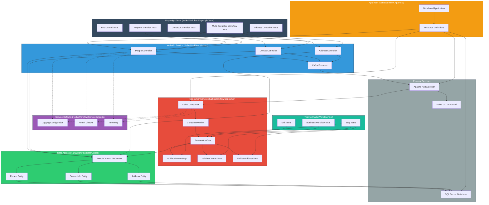

# KafkaWorkflow Solution Architecture

## Overview

The KafkaWorkflow solution is a distributed event-driven application built on .NET 10 and Aspire. It demonstrates a complete system for processing person, contact, and address information through multiple microservices coordinated via Apache Kafka.

**Technology Stack:**
- **.NET 10** - Core framework
- **Aspire** - Container orchestration and observability
- **Kafka** - Event streaming and async messaging
- **SQL Server** - Data persistence
- **Playwright** - E2E and integration testing

---

## System Architecture Diagram

```
┌─────────────────────────────────────────────────────────────────────────┐
│                          KafkaWorkflow System                            │
│                         (Aspire Orchestrated)                            │
└─────────────────────────────────────────────────────────────────────────┘

                              ASPIRE DASHBOARD
                         (Monitoring & Control)
                                  ▲
                    ┌─────────────┴─────────────┐
                    │                           │
                    ▼                           ▼
        ┌──────────────────────┐    ┌──────────────────────┐
        │   HTTP Clients       │    │   Service Mesh       │
        │   (Playwright/User)  │    │   (Aspire Features)  │
        └──────────────────────┘    └──────────────────────┘
                    │                           │
                    └─────────────┬─────────────┘
                                  │
                    ┌─────────────▼──────────────┐
                    │    Load Balancer / Router   │
                    │    (Aspire Endpoints)       │
                    └─────────────┬──────────────┘
                                  │
        ┌─────────────────────────┼─────────────────────────┐
        │                         │                         │
        ▼                         ▼                         ▼
┌──────────────────┐      ┌──────────────────┐     ┌──────────────────┐
│  WebAPI Service  │      │ Kafka Consumer   │     │  Data Access     │
│  (Controllers)   │      │   (Event Handler)│     │    Layer         │
│                  │      │                  │     │   (DbContext)    │
│ • People        │      │ • Workflows      │     │                  │
│ • Contacts      │      │ • Validators     │     │ • PeopleContext  │
│ • Addresses     │      │ • Transformers   │     │ • Entities       │
│                  │      │                  │     │                  │
└────────┬─────────┘      └────────┬─────────┘     └────────┬─────────┘
         │                         │                        │
         │    ┌────────────────────┼────────────────────┐   │
         │    │                    │                    │   │
         │    ▼                    ▼                    │   │
         │  ┌─────────────────────────────┐           │   │
         │  │   Kafka Topics              │           │   │
         │  │   (Event Bus)               │           │   │
         │  │                             │           │   │
         │  │ • people-topic              │           │   │
         │  │   (Create/Update/Delete)    │           │   │
         │  │                             │           │   │
         │  └────────────┬─────────────────┘           │   │
         │               │                             │   │
         │               ├─────────────────────────────┘   │
         │               │                                 │
         └───────────────┼─────────────────────────────────┘
                         │
                         ▼
                   ┌────────────────┐
                   │  SQL Server    │
                   │  (Persistent   │
                   │   Storage)     │
                   │                │
                   │ • People       │
                   │ • Contacts     │
                   │ • Addresses    │
                   └────────────────┘
```

---

## Layered Architecture

```
┌──────────────────────────────────────────────────────────┐
│                  Presentation & Testing Layer             │
├──────────────────────────────────────────────────────────┤
│                                                            │
│  ┌─────────────────┐  ┌────────────────────────────────┐  │
│  │ Playwright Tests│  │ TypeScript Playwright Tests    │  │
│  │   (C# / NUnit)  │  │ (Full E2E Testing)            │  │
│  └─────────────────┘  └────────────────────────────────┘  │
│                                                            │
│  ┌──────────────────────────────────────────────────────┐ │
│  │ Unit Tests (xUnit / NUnit)                           │ │
│  │ - PersonWorkflowTests                               │ │
│  │ - ValidatePersonStepTests                           │ │
│  │ - ValidateContactStepTests                          │ │
│  │ - ValidateAddressStepTests                          │ │
│  └──────────────────────────────────────────────────────┘ │
│                                                            │
└──────────────────────────────────────────────────────────┘
           │
           ▼
┌──────────────────────────────────────────────────────────┐
│               API & Controller Layer                       │
├──────────────────────────────────────────────────────────┤
│                                                            │
│  ┌──────────────────┐  ┌──────────────────────────────┐  │
│  │ PeopleController │  │ ContactController            │  │
│  │                  │  │                              │  │
│  │ • GET /people    │  │ • GET /contact               │  │
│  │ • POST /people   │  │ • POST /contact              │  │
│  │ • PUT /people    │  │ • PUT /contact               │  │
│  │ • DELETE /people │  │ • DELETE /contact            │  │
│  └──────────────────┘  └──────────────────────────────┘  │
│                                                            │
│  ┌──────────────────────────────────────────────────────┐ │
│  │ AddressController                                    │ │
│  │                                                      │ │
│  │ • GET /address                                      │ │
│  │ • POST /address                                     │ │
│  │ • PUT /address                                      │ │
│  │ • DELETE /address                                   │ │
│  └──────────────────────────────────────────────────────┘ │
│                                                            │
└──────────────────────────────────────────────────────────┘
           │
           ▼
┌──────────────────────────────────────────────────────────┐
│              Business Logic & Event Layer                 │
├──────────────────────────────────────────────────────────┤
│                                                            │
│  ┌────────────────────────────────────────────────────┐  │
│  │ Workflow Framework                                 │  │
│  │                                                    │  │
│  │  ┌──────────────────────────────────────────────┐ │  │
│  │  │ IMessageWorkflow<T, TState> (Interface)     │ │  │
│  │  │  - OnExecuteAsync()                         │ │  │
│  │  │  - OnGetStateAsync()                        │ │  │
│  │  └──────────────────────────────────────────────┘ │  │
│  │           ▲                                        │  │
│  │           │                                        │  │
│  │  ┌────────┴─────────┐                            │  │
│  │  │                  │                            │  │
│  │  ▼                  ▼                            │  │
│  │ ┌─────────────┐ ┌──────────────────────────────┐│  │
│  │ │  Business   │ │ IMessageWorkflowStep<T, TS> ││  │
│  │ │  Workflow   │ │  - ShouldExecuteAsync()     ││  │
│  │ │ <T,TState>  │ │  - OnPreExecuteAsync()      ││  │
│  │ │             │ │  - ExecuteAsync()           ││  │
│  │ │ (Abstract)  │ │  - OnCompleteAsync()        ││  │
│  │ │             │ │  - OnErrorAsync()           ││  │
│  │ └─────────────┘ └──────────────────────────────┘│  │
│  │       ▲                      ▲                   │  │
│  │       │                      │                   │  │
│  │       └──────────────────────┼───────────────────┤  │
│  │                              │                   │  │
│  │  ┌────────────────────┐ ┌────┴──────────────┐   │  │
│  │  │ PersonWorkflow     │ │ Validation Steps: │   │  │
│  │  │                    │ │                   │   │  │
│  │  │ Processes:         │ │ • ValidatePerson  │   │  │
│  │  │ - Create Person    │ │ • ValidateContact │   │  │
│  │  │ - Update Person    │ │ • ValidateAddress │   │  │
│  │  │ - Delete Person    │ └───────────────────┘   │  │
│  │  │                    │                         │  │
│  │  └────────────────────┘                         │  │
│  │                                                    │  │
│  └────────────────────────────────────────────────────┘  │
│                                                            │
│  ┌────────────────────────────────────────────────────┐  │
│  │ Event Handling                                     │  │
│  │                                                    │  │
│  │ • Kafka Producer (WebAPI) → Publishes events     │  │
│  │ • Kafka Consumer (ConsumerWorker) → Receives     │  │
│  │ • Topic: people-topic                            │  │
│  │ • Message Format: Key=PersonId, Value=Operation  │  │
│  │                                                    │  │
│  └────────────────────────────────────────────────────┘  │
│                                                            │
└──────────────────────────────────────────────────────────┘
           │
           ▼
┌──────────────────────────────────────────────────────────┐
│              Data Access & Persistence Layer              │
├──────────────────────────────────────────────────────────┤
│                                                            │
│  ┌────────────────────────────────────────────────────┐  │
│  │ PeopleContext (Entity Framework DbContext)         │  │
│  │                                                    │  │
│  │ • DbSet<Person>                                   │  │
│  │ • DbSet<ContactInfo>                              │  │
│  │ • DbSet<Address>                                  │  │
│  │                                                    │  │
│  │ Relationships:                                    │  │
│  │ - Person (1) ──── (N) ContactInfo                │  │
│  │ - ContactInfo (1) ──── (N) Address               │  │
│  │                                                    │  │
│  └────────────────────────────────────────────────────┘  │
│                                                            │
└──────────────────────────────────────────────────────────┘
           │
           ▼
┌──────────────────────────────────────────────────────────┐
│           Infrastructure & External Services             │
├──────────────────────────────────────────────────────────┤
│                                                            │
│  ┌──────────────────┐  ┌──────────────────────────────┐  │
│  │  SQL Server      │  │ Apache Kafka                 │  │
│  │  Database        │  │ Message Broker               │  │
│  │                  │  │                              │  │
│  │ • People Table   │  │ • people-topic               │  │
│  │ • ContactInfo Tbl│  │ • 1 Partition                │  │
│  │ • Address Table  │  │ • Kafka UI Dashboard         │  │
│  │                  │  │                              │  │
│  └──────────────────┘  └──────────────────────────────┘  │
│                                                            │
│  ┌──────────────────────────────────────────────────────┐ │
│  │ Aspire Container Orchestration                       │ │
│  │ • Lifecycle Management                             │ │
│  │ • Health Checks                                    │ │
│  │ • Endpoint Discovery                              │ │
│  │ • Resource Dependencies                           │ │
│  └──────────────────────────────────────────────────────┘ │
│                                                            │
└──────────────────────────────────────────────────────────┘
```

---

## Component Diagram



---

## Data Flow Diagram

```
User/Test Request
      │
      ▼
  ┌──────────────────────┐
  │ HTTP POST /people    │
  │ (Create Person)      │
  └──────────────────────┘
      │
      ▼
  ┌──────────────────────┐
  │ PeopleController     │
  │ • Add to DbContext   │
  │ • SaveChangesAsync() │
  └──────────────────────┘
      │
      ├─────────────────────────────────┐
      │                                 │
      ▼                                 ▼
  ┌────────────────┐          ┌─────────────────────┐
  │ SQL Server     │          │ Kafka Producer      │
  │ (Persist)      │          │                     │
  │                │          │ Publish Event:      │
  │ INSERT Person  │          │ {                   │
  │                │          │   Key: PersonId,    │
  │ Returns ID     │          │   Value: "Create"   │
  │                │          │ }                   │
  └────────────────┘          └──────────┬──────────┘
      │                                 │
      │                                 ▼
      │                         ┌────────────────┐
      │                         │ Kafka Topic    │
      │                         │ (people-topic) │
      │                         └────────┬───────┘
      │                                  │
      │                                  ▼
      │                         ┌─────────────────────┐
      │                         │ Kafka Consumer      │
      │                         │ (ConsumerWorker)    │
      │                         └──────────┬──────────┘
      │                                    │
      │                                    ▼
      │                         ┌─────────────────────┐
      │                         │ PersonWorkflow      │
      │                         │                     │
      │                         │ 1. GetStateAsync()  │
      │                         │    (Load from DB)   │
      │                         └──────────┬──────────┘
      │                                    │
      │                                    ▼
      │                         ┌─────────────────────┐
      │                         │ Execute Steps:      │
      │                         │                     │
      │                         │ • Validate Person   │
      │                         │ • Validate Contact  │
      │                         │ • Validate Address  │
      │                         └──────────┬──────────┘
      │                                    │
      │                                    ▼
      │                         ┌─────────────────────┐
      │                         │ Update State in DB  │
      │                         │                     │
      │                         │ Workflow Complete   │
      │                         └─────────────────────┘
      │
      ▼
  ┌──────────────────────┐
  │ HTTP Response        │
  │ 201 Created          │
  │ {PersonId: 123, ...} │
  └──────────────────────┘
```

---

## Entity Relationship Diagram

```
┌─────────────────────────────────────┐
│          Person                     │
├─────────────────────────────────────┤
│ PK: Id (int)                        │
│ • FirstName (string)                │
│ • LastName (string)                 │
│ • DateOfBirth (DateTime?)           │
│ • CreatedAt (DateTime)              │
│ • UpdatedAt (DateTime)              │
│                                     │
│ Navigation:                         │
│ • ContactInfos (ICollection)        │
└──────────────────────┬──────────────┘
                       │
                       │ 1:N (One Person has Many Contacts)
                       │
                       ▼
┌─────────────────────────────────────┐
│      ContactInfo                    │
├─────────────────────────────────────┤
│ PK: Id (int)                        │
│ FK: PersonId (int)                  │
│ • Email (string)                    │
│ • Phone (string)                    │
│ • Type (ContactType enum)           │
│ • CreatedAt (DateTime)              │
│ • UpdatedAt (DateTime)              │
│                                     │
│ Navigation:                         │
│ • Person (Person)                   │
│ • Addresses (ICollection)           │
└──────────────────────┬──────────────┘
                       │
                       │ 1:N (One Contact has Many Addresses)
                       │
                       ▼
┌─────────────────────────────────────┐
│       Address                       │
├─────────────────────────────────────┤
│ PK: Id (int)                        │
│ FK: ContactInfoId (int)             │
│ • Street (string)                   │
│ • City (string)                     │
│ • State (string)                    │
│ • ZipCode (string)                  │
│ • Country (string)                  │
│ • AddressType (AddressType enum)    │
│ • CreatedAt (DateTime)              │
│ • UpdatedAt (DateTime)              │
│                                     │
│ Navigation:                         │
│ • ContactInfo (ContactInfo)         │
└─────────────────────────────────────┘
```

---

## Deployment Architecture (Aspire)

```
┌─────────────────────────────────────────────────────────────────┐
│                    Aspire Dashboard                              │
│          (http://localhost:15251)                                │
│                                                                   │
│  ┌──────────────────────────────────────────────────────────┐  │
│  │ Resources Tab                                            │  │
│  │                                                          │  │
│  │ ┌──────────────────────────────────────────────────────┐ │  │
│  │ │ • webapi (ProjectResource)                           │ │  │
│  │ │   Status: Running                                    │ │  │
│  │ │   Ports: 5000 (HTTP), 5001 (HTTPS)                  │ │  │
│  │ │   Depends: database, kafka                           │ │  │
│  │ │   [View Logs] [Console] [Traces]                     │ │  │
│  │ └──────────────────────────────────────────────────────┘ │  │
│  │                                                          │  │
│  │ ┌──────────────────────────────────────────────────────┐ │  │
│  │ │ • kafka-consumer (ProjectResource)                   │ │  │
│  │ │   Status: Running                                    │ │  │
│  │ │   Depends: database, kafka                           │ │  │
│  │ │   [View Logs] [Console] [Traces]                     │ │  │
│  │ └──────────────────────────────────────────────────────┘ │  │
│  │                                                          │  │
│  │ ┌──────────────────────────────────────────────────────┐ │  │
│  │ │ • database (ContainerResource)                       │ │  │
│  │ │   Status: Healthy                                    │ │  │
│  │ │   Image: mcr.microsoft.com/mssql/server:2022...      │ │  │
│  │ │   Port: 57242 (bound)                                │ │  │
│  │ │   Volume: sqlserver-data (persistent)               │ │  │
│  │ │   [Connection String]                                │ │  │
│  │ └──────────────────────────────────────────────────────┘ │  │
│  │                                                          │  │
│  │ ┌──────────────────────────────────────────────────────┐ │  │
│  │ │ • kafka (ContainerResource)                          │ │  │
│  │ │   Status: Healthy                                    │ │  │
│  │ │   Image: confluentinc/cp-kafka:latest                │ │  │
│  │ │   Port: 9092 (bound)                                 │ │  │
│  │ │   Volume: kafka-data (persistent)                   │ │  │
│  │ │   UI: http://localhost:8080/                         │ │  │
│  │ │   [Connection String]                                │ │  │
│  │ └──────────────────────────────────────────────────────┘ │  │
│  │                                                          │  │
│  │ ┌──────────────────────────────────────────────────────┐ │  │
│  │ │ • playwright (ProjectResource)                       │ │  │
│  │ │   Status: Stopped (ExplicitStart)                    │ │  │
│  │ │   Depends: webapi                                    │ │  │
│  │ │   [Run] [View Logs]                                  │ │  │
│  │ └──────────────────────────────────────────────────────┘ │  │
│  │                                                          │  │
│  └──────────────────────────────────────────────────────────┘  │
│                                                                   │
│  ┌──────────────────────────────────────────────────────────┐  │
│  │ Logs Tab                                                 │  │
│  │ [Real-time logs from all resources]                     │  │
│  └──────────────────────────────────────────────────────────┘  │
│                                                                   │
│  ┌──────────────────────────────────────────────────────────┐  │
│  │ Traces Tab                                               │  │
│  │ [OpenTelemetry traces across services]                  │  │
│  └──────────────────────────────────────────────────────────┘  │
│                                                                   │
└─────────────────────────────────────────────────────────────────┘
           │
           │ Orchestrates & Monitors
           │
           ▼
┌─────────────────────────────────────────────────────────────────┐
│              Docker Containers (Local)                           │
│                                                                   │
│  ┌──────────────┐  ┌──────────────┐  ┌───────────────────────┐ │
│  │   WebAPI     │  │   Consumer   │  │    SQL Server DB      │ │
│  │  Container   │  │  Container   │  │   Container           │ │
│  │              │  │              │  │                       │ │
│  │ :5000/5001   │  │              │  │ Port: 57242           │ │
│  └──────┬───────┘  └──────┬───────┘  └───────────────────────┘ │
│         │                 │                  ▲                  │
│         └─────────┬───────┘                  │                  │
│                   │ Communicate via          │                  │
│                   │ Named Pipes              │ Persists to      │
│                   │                          │                  │
│                   ▼                          │                  │
│          ┌──────────────────┐                │                  │
│          │ Kafka Broker     │                │                  │
│          │ Container        │                │                  │
│          │                  │                │                  │
│          │ Port: 9092       │                │                  │
│          │ Kafka UI: :8080  │                │                  │
│          │                  │────────────────┘                  │
│          └──────────────────┘                                   │
│                                                                   │
│  Volumes:                                                        │
│  • sqlserver-data: /var/lib/mssql/data                          │
│  • kafka-data: /var/lib/kafka/data                              │
│                                                                   │
└─────────────────────────────────────────────────────────────────┘
```

---

## Testing Architecture

```
┌─────────────────────────────────────────────────────────────────┐
│                      Testing Strategy                            │
└─────────────────────────────────────────────────────────────────┘

┌─────────────────────────────────────────────────────────────────┐
│                    Unit Tests (Integration)                      │
│                  (KafkaWorkflow.Test Project)                    │
├─────────────────────────────────────────────────────────────────┤
│                                                                   │
│  Test Suites:                                                    │
│                                                                   │
│  ┌─────────────────────────────────────────────────────────┐   │
│  │ PersonWorkflowTests                                     │   │
│  │                                                         │   │
│  │ • Test_OnExecuteAsync_ExecutesAllSteps()               │   │
│  │ • Test_OnExecuteAsync_SkipsStepsWhenShouldExecute...   │   │
│  │ • Test_OnExecuteAsync_WithCancellationToken()          │   │
│  │ • Test_OnErrorAsync_ContinuesWhenReturningTrue()       │   │
│  │ • Test_OnErrorAsync_StopsWhenReturningFalse()          │   │
│  │                                                         │   │
│  │ Mocks: IWorkflowLogger, IMessageWorkflowStep           │   │
│  │ Framework: NUnit with Moq                              │   │
│  └─────────────────────────────────────────────────────────┘   │
│                                                                   │
│  ┌─────────────────────────────────────────────────────────┐   │
│  │ ValidatePersonStepTests                                 │   │
│  │                                                         │   │
│  │ • Test_ShouldExecuteAsync_ReturnsTrueWhenValid()       │   │
│  │ • Test_ExecuteAsync_ValidatesPersonData()             │   │
│  │ • Test_OnErrorAsync_HandlesValidationErrors()         │   │
│  │                                                         │   │
│  │ Mocks: IObjectAccessor, IWorkflowLogger                │   │
│  │ Framework: NUnit with Moq                              │   │
│  └─────────────────────────────────────────────────────────┘   │
│                                                                   │
│  ┌─────────────────────────────────────────────────────────┐   │
│  │ ValidateContactStepTests                                │   │
│  │ ValidateAddressStepTests                                │   │
│  │                                                         │   │
│  │ Similar test patterns for contact and address steps    │   │
│  │                                                         │   │
│  │ Framework: NUnit with Moq                              │   │
│  └─────────────────────────────────────────────────────────┘   │
│                                                                   │
└─────────────────────────────────────────────────────────────────┘

┌─────────────────────────────────────────────────────────────────┐
│               End-to-End Tests (Playwright C#)                   │
│           (KafkaWorkflow.PlaywrightTests Project)                │
├─────────────────────────────────────────────────────────────────┤
│                                                                   │
│  Architecture: DistributedApplicationTestingBuilder             │
│  Framework: NUnit + Playwright + Aspire.Hosting.Testing         │
│                                                                   │
│  ┌─────────────────────────────────────────────────────────┐   │
│  │ PeopleControllerTests                                   │   │
│  │                                                         │   │
│  │ • Test_Get_Returns_AllPersons_With_ValidResponse()     │   │
│  │ • Test_Get_Returns_ListOfPersons()                     │   │
│  │ • Test_Post_CreatesNewPerson()                         │   │
│  │ • Test_Put_UpdatesExistingPerson()                     │   │
│  │ • Test_Delete_RemovesPerson()                          │   │
│  │                                                         │   │
│  │ Uses: HttpClient, CreateHttpClient()                   │   │
│  └─────────────────────────────────────────────────────────┘   │
│                                                                   │
│  ┌─────────────────────────────────────────────────────────┐   │
│  │ ContactControllerTests                                  │   │
│  │ AddressControllerTests                                  │   │
│  │                                                         │   │
│  │ Similar patterns for contact and address endpoints     │   │
│  │                                                         │   │
│  │ Uses: HttpClient, GetBaseUrl()                         │   │
│  └─────────────────────────────────────────────────────────┘   │
│                                                                   │
│  ┌─────────────────────────────────────────────────────────┐   │
│  │ MultiControllerWorkflowTests                            │   │
│  │                                                         │   │
│  │ • Test_Workflow_CreatePersonAndContact_VerifyRel...    │   │
│  │ • Test_Workflow_CreatePersonContactAddress_VerifyAll() │   │
│  │ • Test_Workflow_MulitpleOperations_EnsureDataConsist() │   │
│  │                                                         │   │
│  │ Tests: Cross-controller workflows                      │   │
│  │ Uses: Kafka event processing verification              │   │
│  └─────────────────────────────────────────────────────────┘   │
│                                                                   │
│  ┌─────────────────────────────────────────────────────────┐   │
│  │ PeopleControllerErrorHandlingTests                      │   │
│  │                                                         │   │
│  │ • Test_Post_InvalidData_ReturnsBadRequest()            │   │
│  │ • Test_Delete_NonexistentId_ReturnsNotFound()          │   │
│  │ • Test_Put_ConflictingData_ReturnsConflict()           │   │
│  │                                                         │   │
│  │ Tests: Error handling and edge cases                   │   │
│  │ Uses: HttpStatusCode validation                        │   │
│  └─────────────────────────────────────────────────────────┘   │
│                                                                   │
│  Execution Flow:                                                 │
│  1. SetUp() → Start Aspire app via DistributedApplicationTest... │
│  2. Auto-discover webapi endpoint from SERVICES__WEBAPI__HTTP__0 │
│  3. Wait for service health                                     │
│  4. Launch Playwright browser                                   │
│  5. Execute test using HttpClient or browser                    │
│  6. TearDown() → Stop Aspire app and close browser              │
│                                                                   │
└─────────────────────────────────────────────────────────────────┘

┌─────────────────────────────────────────────────────────────────┐
│            End-to-End Tests (Playwright TypeScript)              │
│        (test/KafkaWorkflow.PlaywrightTests.TypeScript)           │
├─────────────────────────────────────────────────────────────────┤
│                                                                   │
│  Framework: Playwright Test (Node.js)                            │
│  Language: TypeScript                                            │
│                                                                   │
│  ┌─────────────────────────────────────────────────────────┐   │
│  │ people.spec.ts                                          │   │
│  │ contact.spec.ts                                         │   │
│  │ address.spec.ts                                         │   │
│  │                                                         │   │
│  │ • Browser-based API testing                            │   │
│  │ • UI interaction testing (if applicable)               │   │
│  │ • Cross-browser testing support                        │   │
│  │                                                         │   │
│  │ Uses: API fixtures, test utilities                     │   │
│  └─────────────────────────────────────────────────────────┘   │
│                                                                   │
│  Fixtures:                                                       │
│  • api.fixture.ts → API client setup                            │
│  • test-data.ts → Test data generation                          │
│  • assertions.ts → Custom assertion helpers                     │
│                                                                   │
└─────────────────────────────────────────────────────────────────┘

┌─────────────────────────────────────────────────────────────────┐
│                    Test Execution Commands                       │
├─────────────────────────────────────────────────────────────────┤
│                                                                   │
│  Unit Tests:                                                     │
│  $ dotnet test test/KafkaWorkflow.Test                          │
│                                                                   │
│  Playwright C# E2E Tests (via Aspire):                          │
│  $ dotnet run --project KafkaWorkflow.AppHost                   │
│  (Then click "Run" on playwright resource in dashboard)          │
│                                                                   │
│  Playwright C# E2E Tests (standalone):                          │
│  $ dotnet test test/KafkaWorkflow.PlaywrightTests              │
│                                                                   │
│  Playwright TypeScript Tests:                                   │
│  $ cd test/KafkaWorkflow.PlaywrightTests.TypeScript             │
│  $ npm install                                                   │
│  $ npx playwright test                                           │
│                                                                   │
│  Playwright TypeScript Tests (UI Mode):                         │
│  $ npx playwright test --ui                                     │
│                                                                   │
│  Playwright TypeScript Tests (Headed):                          │
│  $ npx playwright test --headed                                 │
│                                                                   │
└─────────────────────────────────────────────────────────────────┘
```

---

## Project Structure

```
KafkaWorkflow/
├── src/
│   ├── KafkaWorkflow.WebApi/
│   │   ├── Controllers/
│   │   │   ├── PeopleController.cs
│   │   │   ├── ContactController.cs
│   │   │   └── AddressController.cs
│   │   ├── appsettings.json
│   │   ├── Program.cs
│   │   └── KafkaWorkflow.WebApi.csproj
│   │
│   ├── KafkaWorkflow.Consumer/
│   │   ├── Base/
│   │   │   └── Workflow/
│   │   │       ├── BusinessWorkflow.cs (Abstract<T, TState>)
│   │   │       ├── IMessageWorkflow.cs
│   │   │       ├── IMessageWorkflowStep.cs
│   │   │       ├── MessageWorkflowStep.cs (Abstract)
│   │   │       ├── IWorkflowLogger.cs
│   │   │       ├── WorkflowLogger.cs
│   │   │       ├── IObjectAccessor.cs
│   │   │       ├── ObjectAccessor.cs
│   │   │       └── WorkflowStage.cs (Enum)
│   │   ├── PeopleWorkflow/
│   │   │   ├── PersonWorkflow.cs (extends BusinessWorkflow)
│   │   │   ├── PersonState.cs
│   │   │   └── Steps/
│   │   │       ├── ValidatePersonStep.cs
│   │   │       ├── ValidateContactStep.cs
│   │   │       └── ValidateAddressStep.cs
│   │   ├── ConsumerWorker.cs (BackgroundService)
│   │   ├── Program.cs
│   │   └── KafkaWorkflow.Consumer.csproj
│   │
│   ├── KafkaWorkflow.DataAccess/
│   │   ├── Entities/
│   │   │   ├── Person.cs
│   │   │   ├── ContactInfo.cs
│   │   │   └── Address.cs
│   │   ├── Enums/
│   │   │   └── OperationType.cs
│   │   ├── PeopleContext.cs (DbContext)
│   │   └── KafkaWorkflow.DataAccess.csproj
│   │
│   ├── KafkaWorkflow.AppHost/
│   │   ├── AppHost.cs (Main orchestration)
│   │   ├── initSql.sql (Database initialization)
│   │   ├── Program.cs
│   │   └── KafkaWorkflow.AppHost.csproj
│   │
│   ├── KafkaWorkflow.ServiceDefaults/
│   │   ├── Extensions.cs
│   │   └── KafkaWorkflow.ServiceDefaults.csproj
│   │
│   └── test/
│       ├── KafkaWorkflow.Test/
│       │   ├── PersonWorkflowTests.cs
│       │   ├── ValidatePersonStepTests.cs
│       │   ├── ValidateContactStepTests.cs
│       │   ├── ValidateAddressStepTests.cs
│       │   └── KafkaWorkflow.Test.csproj
│       │
│       ├── KafkaWorkflow.PlaywrightTests/
│       │   ├── PlaywrightFixture.cs (Base fixture class)
│       │   ├── TestUtilities.cs
│       │   ├── dto/
│       │   │   ├── PersonDto.cs
│       │   │   ├── ContactInfoDto.cs
│       │   │   └── AddressDto.cs
│       │   ├── tests/
│       │   │   ├── PeopleControllerTests.cs
│       │   │   ├── ContactControllerTests.cs
│       │   │   ├── AddressControllerTests.cs
│       │   │   ├── MultiControllerWorkflowTests.cs
│       │   │   └── PeopleControllerErrorHandlingTests.cs
│       │   ├── ASPIRE_MIGRATION_GUIDE.md
│       │   ├── ASPIRE_SETUP.md
│       │   ├── ASPIRE_QUICK_START.md
│       │   ├── README.md
│       │   └── KafkaWorkflow.PlaywrightTests.csproj
│       │
│       └── KafkaWorkflow.PlaywrightTests.TypeScript/
│           ├── tests/
│           │   ├── people.spec.ts
│           │   ├── contact.spec.ts
│           │   ├── address.spec.ts
│           │   ├── fixtures/
│           │   │   └── api.fixture.ts
│           │   └── utils/
│           │       ├── api-client.ts
│           │       ├── test-data.ts
│           │       └── assertions.ts
│           ├── playwright.config.ts
│           ├── package.json
│           ├── tsconfig.json
│           └── .env.example
│
└── ARCHITECTURE.md (This file)
```

---

## Technology Stack Summary

| Layer | Technology | Version | Purpose |
|-------|-----------|---------|---------|
| **Runtime** | .NET | 10.0 | Core framework |
| **Container Orchestration** | Aspire | 1.0+ | Service orchestration & observability |
| **Web Framework** | ASP.NET Core | 10.0 | REST API framework |
| **ORM** | Entity Framework Core | 10.0 | Data access |
| **Database** | SQL Server | 2022 | Data persistence |
| **Message Broker** | Apache Kafka | Latest | Event streaming |
| **Browser Testing** | Playwright | 1.59+ | E2E testing (C#) |
| **TypeScript Testing** | Playwright Test | Latest | E2E testing (TS) |
| **Unit Testing** | NUnit | 4.5+ | Unit test framework |
| **Mocking** | Moq | Latest | Mocking library |
| **Logging** | Serilog | Latest | Structured logging |
| **Configuration** | appsettings.json | - | App configuration |
| **Dependency Injection** | Microsoft DI | Built-in | Service container |

---

## Key Design Patterns

### 1. **Workflow Pattern**
- Generic workflow framework using generics: `BusinessWorkflow<T, TState>`
- Template Method pattern for step execution
- State management with `IObjectAccessor<TState>`

### 2. **Producer-Consumer Pattern**
- WebAPI produces events to Kafka
- ConsumerWorker consumes events from Kafka
- Asynchronous, decoupled communication

### 3. **Dependency Injection**
- All services use constructor injection
- Configured in `Program.cs` files
- Supports multiple implementations of interfaces

### 4. **Repository Pattern** (implicit)
- `DbContext` acts as repository
- Entity Framework manages data access
- Abstraction through navigation properties

### 5. **Logging Abstraction**
- `IWorkflowLogger<T, TState>` abstracts logging
- Structured logging with stages (PreExecute, Execute, Complete)
- Extensible for different logging providers

### 6. **Health Checks**
- Service-level health checks via endpoints
- Aspire integration for resource health
- Database connectivity validation

---

## Communication Patterns

### Synchronous (HTTP)
```
Client → WebAPI Controller → DbContext → SQL Server
↓
HTTP Response ← Serialized JSON
```

### Asynchronous (Event-Driven via Kafka)
```
WebAPI → Kafka Topic (people-topic)
                ↓
         Consumer Worker
                ↓
         PersonWorkflow → Validation Steps
                ↓
         Update State in DbContext
                ↓
         Persist to SQL Server
```

---

## Performance Considerations

1. **Database**
   - Connection pooling via Entity Framework
   - Async/await for non-blocking operations
   - Indexes on foreign keys

2. **Kafka**
   - Single partition topic for ordering
   - Consumer group for scaling
   - Async processing in worker

3. **API**
   - Minimal allocations with async I/O
   - Efficient JSON serialization
   - Connection keepalive

4. **Workflow**
   - Step-based execution
   - Early exit on validation failure
   - Async step execution

---

## Security Considerations

1. **API**
   - HTTPS in production
   - Self-signed certs in development
   - Request validation

2. **Database**
   - Connection string security
   - Entity-level authorization (if needed)
   - SQL injection prevention via EF

3. **Kafka**
   - Docker network isolation
   - SASL/SSL in production
   - Consumer group authentication

4. **Testing**
   - Test data isolation
   - No production credentials in code
   - Environment-specific configuration

---

## Scalability Strategy

1. **Horizontal Scaling**
   - Consumer Workers (multiple instances)
   - Kafka consumer groups
   - Stateless API services

2. **Database Scaling**
   - Read replicas for reporting
   - Connection pooling
   - Partitioning for large datasets

3. **Kafka Scaling**
   - Multiple partitions per topic
   - Consumer group rebalancing
   - Retention policies

4. **API Scaling**
   - Load balancer (in Aspire)
   - Stateless request handling
   - Caching where applicable

---

## Monitoring & Observability

1. **Aspire Dashboard**
   - Real-time resource status
   - Log aggregation
   - Trace visualization

2. **Logging**
   - Structured logs via Serilog
   - Workflow stage tracking
   - Error details capture

3. **Health Checks**
   - Database connectivity
   - Kafka connectivity
   - Service readiness

4. **Traces (OpenTelemetry)**
   - Request tracing across services
   - Step execution tracing
   - Database query tracking

---

## Future Enhancements

1. **Caching**
   - Redis for frequently accessed data
   - Cache invalidation strategy
   - Distributed cache coherence

2. **API Versioning**
   - Semantic versioning
   - Backward compatibility
   - Deprecation policies

3. **Event Sourcing**
   - Event store for workflow history
   - Audit trails
   - Temporal queries

4. **CQRS**
   - Separate read/write models
   - Optimized queries
   - Event-driven synchronization

5. **Service Mesh**
   - Istio or Linkerd integration
   - Traffic management
   - Security policies

6. **Additional Workflows**
   - Contact workflow
   - Address workflow
   - Cross-entity workflows

---

## Conclusion

The KafkaWorkflow solution demonstrates a modern, cloud-native .NET architecture using:
- **Microservices** with async communication
- **Event-Driven** architecture via Kafka
- **Infrastructure-as-Code** with Aspire
- **Comprehensive Testing** at multiple levels
- **Production-Ready** patterns and practices

This foundation provides a scalable, maintainable, and observable system ready for enterprise workloads.
