# KafkaWorkflow - Architecture Diagrams

## 1. System Architecture Overview

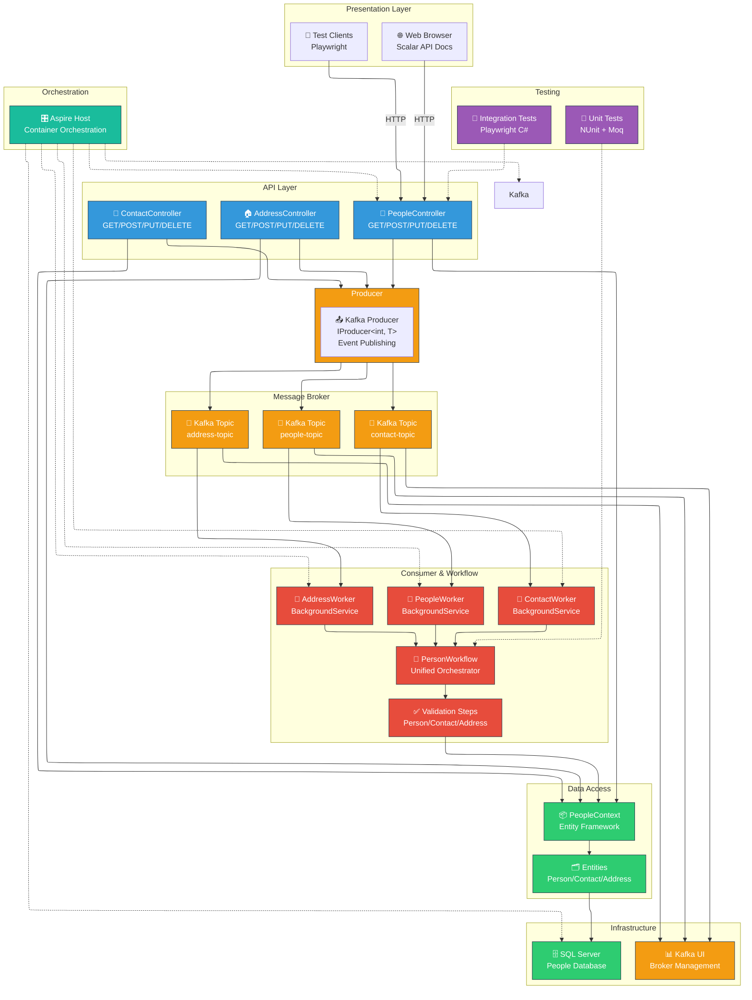

---

## 2. Component Interaction & Data Flow

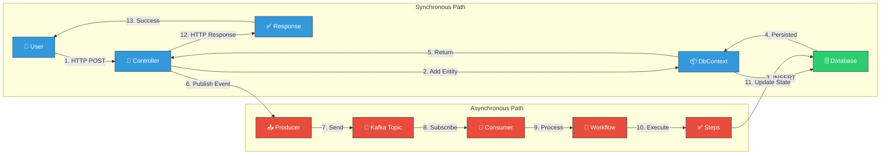

---

## 3. Service Dependencies & Wiring

```mermaid
graph TB
    subgraph "AppHost.cs - Orchestration"
        AppHost["🎛️ DistributedApplication<br/>Resource Definitions"]
    end

    subgraph "SQL Server Container"
        SqlServerContainer["🗄️ SQL Server<br/>Port: 55245"]
        InitScript["📜 initSql.sql<br/>Schema & Data"]
    end

    subgraph "Kafka Container"
        KafkaContainer["🔌 Apache Kafka<br/>Port: 9092"]
        KafkaUIContainer["📊 Kafka UI<br/>Port: 8080"]
    end

    subgraph "WebAPI Service"
        WebApiProj["KafkaWorkflow.WebApi"]
        Program["Program.cs<br/>Service Registration"]
        Controllers["3x Controllers<br/>REST Endpoints"]
    end

    subgraph "Consumer Service"
        ConsumerProj["KafkaWorkflow.Consumer"]
        ConsumerProgram["Program.cs<br/>Worker Registration"]
        PeopleWorkerSvc["PeopleWorker<br/>BackgroundService"]
        ContactWorkerSvc["ContactWorker<br/>BackgroundService"]
        AddressWorkerSvc["AddressWorker<br/>BackgroundService"]
    end

    subgraph "Shared Libraries"
        DataAccess["KafkaWorkflow.DataAccess<br/>DbContext, Entities"]
        ServiceDefaults["KafkaWorkflow.ServiceDefaults<br/>Logging, Health Checks"]
    end

    AppHost -->|Creates| SqlServerContainer
    AppHost -->|Creates| KafkaContainer
    AppHost -->|Creates| KafkaUIContainer
    AppHost -->|Starts| WebApiProj
    AppHost -->|Starts| ConsumerProj
    
    SqlServerContainer -->|Executes| InitScript
    
    WebApiProj -->|Depends| DataAccess
    WebApiProj -->|Depends| ServiceDefaults
    WebApiProj -->|References| SqlServerContainer
    WebApiProj -->|References| KafkaContainer
    
    ConsumerProj -->|Depends| DataAccess
    ConsumerProj -->|Depends| ServiceDefaults
    ConsumerProj -->|References| SqlServerContainer
    ConsumerProj -->|References| KafkaContainer
    
    Program -->|Registers| Controllers
    ConsumerProgram -->|Registers| PeopleWorkerSvc
    ConsumerProgram -->|Registers| ContactWorkerSvc
    ConsumerProgram -->|Registers| AddressWorkerSvc
    
    classDef orchestration fill:#1abc9c,stroke:#2c3e50,color:#fff
    classDef service fill:#3498db,stroke:#2c3e50,color:#fff
    classDef infrastructure fill:#f39c12,stroke:#2c3e50,color:#fff
    classDef library fill:#9b59b6,stroke:#2c3e50,color:#fff
    
    class AppHost orchestration
    class WebApiProj,ConsumerProj service
    class SqlServerContainer,KafkaContainer,KafkaUIContainer infrastructure
    class DataAccess,ServiceDefaults library
```

---

## 4. Workflow Execution Pipeline

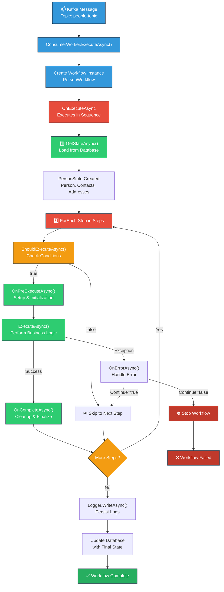

---

## 5. Database Entity Relationships

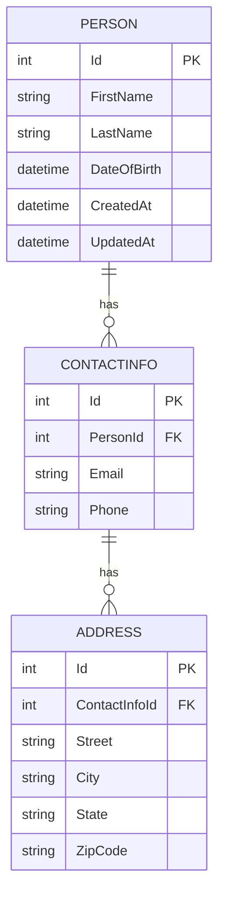

---

## 6. Class Hierarchy - Workflow Framework

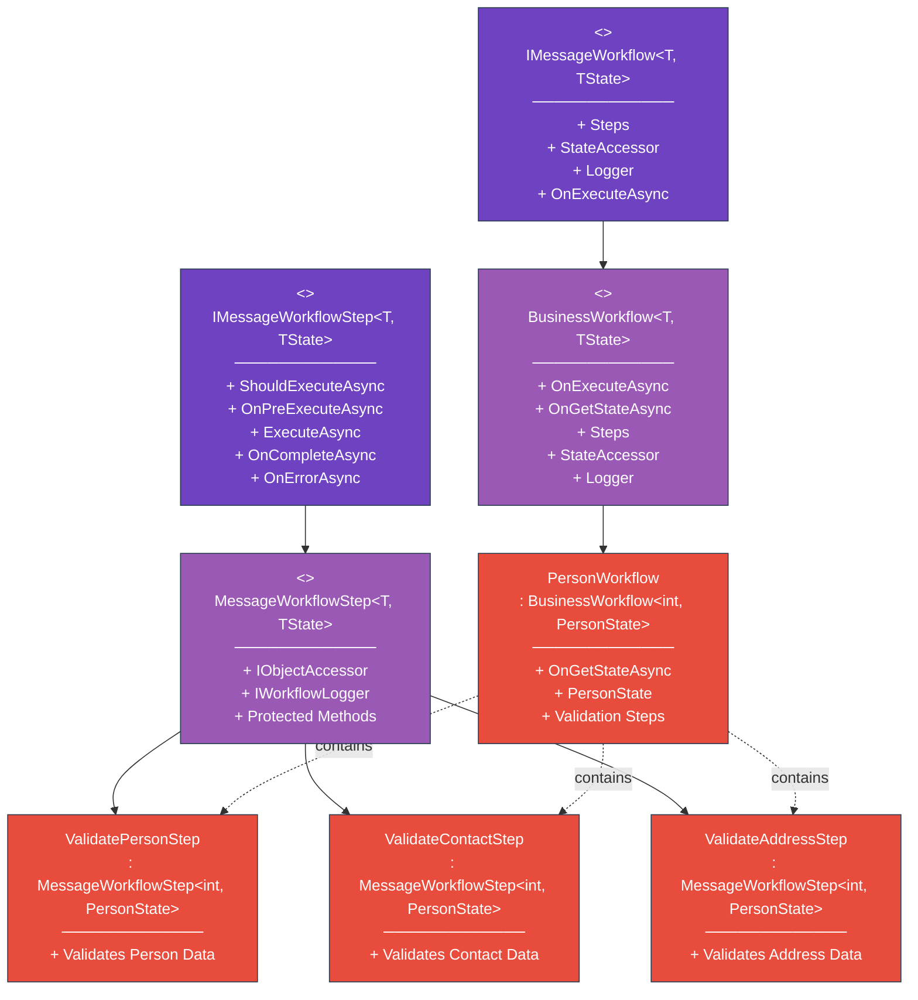

---

## 7. REST API Endpoints

```mermaid
graph TB
    subgraph "PeopleController"
        Get["GET /people<br/>Returns all people<br/>✅ 200 OK"]
        GetById["GET /people/{personId}<br/>Returns person by ID<br/>✅ 200 OK | ❌ 404 Not Found"]
        Post["POST /people<br/>Creates new person<br/>Body: {firstName, lastName, age}<br/>✅ 201 Created | ❌ 400 Bad Request"]
        Put["PUT /people<br/>Updates person<br/>Body: {id, firstName, lastName, age}<br/>✅ 200 OK | ❌ 404 Not Found"]
        Delete["DELETE /people/{id}<br/>Deletes person<br/>✅ 200 OK | ❌ 404 Not Found"]
    end

    subgraph "ContactController"
        GetContact["GET /contact<br/>Returns all contacts<br/>✅ 200 OK"]
        GetContactById["GET /contact/{contactInfoId}<br/>Returns contact by ID<br/>✅ 200 OK | ❌ 404 Not Found"]
        PostContact["POST /contact/{personId}<br/>Creates new contact<br/>Route: personId<br/>Body: {email, phone}<br/>✅ 201 Created | ❌ 400/404"]
        PutContact["PUT /contact<br/>Updates contact<br/>Body: {id, email, phone, personId}<br/>✅ 200 OK | ❌ 404 Not Found"]
        DeleteContact["DELETE /contact/{id}<br/>Deletes contact<br/>✅ 200 OK | ❌ 404 Not Found"]
    end

    subgraph "AddressController"
        GetAddress["GET /address<br/>Returns all addresses<br/>✅ 200 OK"]
        GetAddressById["GET /address/{addressId}<br/>Returns address by ID<br/>✅ 200 OK | ❌ 404 Not Found"]
        PostAddress["POST /address/{contactInfoId}<br/>Creates new address<br/>Route: contactInfoId<br/>Body: {street, city, state, zipCode}<br/>✅ 201 Created | ❌ 400/404"]
        PutAddress["PUT /address<br/>Updates address<br/>Body: {id, street, city, state, zipCode, contactInfoId}<br/>✅ 200 OK | ❌ 404 Not Found"]
        DeleteAddress["DELETE /address/{id}<br/>Deletes address<br/>✅ 200 OK | ❌ 404 Not Found"]
    end

    subgraph "Business Logic Flow"
        DbInsert["1️⃣ INSERT to Database<br/>SaveChangesAsync()"]
        PublishEvent["2️⃣ Publish to Kafka<br/>Topic: people-topic<br/>Topic: contact-topic<br/>Topic: address-topic"]
        Response["3️⃣ HTTP Response<br/>Location: /resource/{id}"]
    end

    Post -->|Execute| DbInsert
    PostContact -->|Execute| DbInsert
    PostAddress -->|Execute| DbInsert
    Put -->|Execute| DbInsert
    PutContact -->|Execute| DbInsert
    PutAddress -->|Execute| DbInsert
    Delete -->|Execute| DbInsert
    DeleteContact -->|Execute| DbInsert
    DeleteAddress -->|Execute| DbInsert

    DbInsert -->|Success| PublishEvent
    PublishEvent -->|Complete| Response
    Response -->|201 Created| Client["📱 Client"]

    classDef endpoint fill:#3498db,stroke:#2c3e50,color:#fff
    classDef getEndpoint fill:#27ae60,stroke:#2c3e50,color:#fff
    classDef success fill:#2ecc71,stroke:#2c3e50,color:#fff
    classDef error fill:#e74c3c,stroke:#2c3e50,color:#fff
    classDef logic fill:#f39c12,stroke:#2c3e50,color:#fff

    class Post,PostContact,PostAddress,Put,PutContact,PutAddress,Delete,DeleteContact,DeleteAddress endpoint
    class Get,GetById,GetContact,GetContactById,GetAddress,GetAddressById getEndpoint
    class DbInsert,PublishEvent logic
    class Response success
```

---

## 8. Testing Architecture Pyramid

```mermaid
graph TD
    Pyramid["Testing Pyramid"]
    
    subgraph "Unit Tests (Bottom - Fast)"
        UT1["PersonWorkflowTests<br/>✓ 4 test cases"]
        UT2["ValidatePersonStepTests<br/>✓ 3 test cases"]
        UT3["ValidateContactStepTests<br/>✓ 3 test cases"]
        UT4["ValidateAddressStepTests<br/>✓ 3 test cases"]
    end
    
    subgraph "Integration Tests (Middle - Medium)"
        IT1["PeopleControllerTests<br/>✓ 5 test cases"]
        IT2["ContactControllerTests<br/>✓ 5 test cases"]
        IT3["AddressControllerTests<br/>✓ 5 test cases"]
        IT4["MultiControllerWorkflowTests<br/>✓ 3 test cases"]
        IT5["PeopleControllerErrorHandlingTests<br/>✓ 4 test cases"]
    end
    
    subgraph "E2E Tests (Top - Slow)"
        E2E1["people.spec.ts<br/>✓ Playwright"]
        E2E2["contact.spec.ts<br/>✓ Playwright"]
        E2E3["address.spec.ts<br/>✓ Playwright"]
    end
    
    UT1 --> Framework1["Framework:<br/>NUnit + Moq"]
    UT2 --> Framework1
    UT3 --> Framework1
    UT4 --> Framework1
    
    IT1 --> Framework2["Framework:<br/>NUnit + Playwright<br/>+ Aspire"]
    IT2 --> Framework2
    IT3 --> Framework2
    IT4 --> Framework2
    IT5 --> Framework2
    
    E2E1 --> Framework3["Framework:<br/>Playwright<br/>TypeScript"]
    E2E2 --> Framework3
    E2E3 --> Framework3
    
    Framework1 -.->|13 Tests| Cost1["⚡ Cost: Low<br/>Time: &lt;1s"]
    Framework2 -.->|22 Tests| Cost2["⚡⚡⚡ Cost: Medium<br/>Time: 5-30s"]
    Framework3 -.->|~10 Tests| Cost3["⚡⚡⚡⚡⚡ Cost: High<br/>Time: 30-120s"]
    
    classDef unittests fill:#2ecc71,stroke:#2c3e50,color:#fff
    classDef integration fill:#f39c12,stroke:#2c3e50,color:#fff
    classDef e2e fill:#e74c3c,stroke:#2c3e50,color:#fff
    classDef framework fill:#3498db,stroke:#2c3e50,color:#fff
    classDef cost fill:#9b59b6,stroke:#2c3e50,color:#fff
    
    class UT1,UT2,UT3,UT4 unittests
    class IT1,IT2,IT3,IT4,IT5 integration
    class E2E1,E2E2,E2E3 e2e
    class Framework1,Framework2,Framework3 framework
    class Cost1,Cost2,Cost3 cost
```

---

## 9. Aspire Dashboard Resources

```mermaid
graph TB
    Dashboard["🎛️ Aspire Dashboard<br/>http://localhost:15251"]
    
    Dashboard --> Resources["📊 Resources Tab"]
    Dashboard --> Logs["📝 Logs Tab"]
    Dashboard --> Traces["🔍 Traces Tab"]
    
    Resources --> WebAPI["webapi<br/>ProjectResource<br/>State: Running<br/>Port: 5000/5001<br/>Depends: db, kafka"]
    Resources --> Consumer["kafka-consumer<br/>ProjectResource<br/>State: Running<br/>Depends: db, kafka"]
    Resources --> SqlServer["database<br/>ContainerResource<br/>State: Healthy<br/>Port: 55245<br/>Volume: sqlserver-data"]
    Resources --> Kafka["kafka<br/>ContainerResource<br/>State: Healthy<br/>Port: 9092<br/>Volume: kafka-data"]
    Resources --> KafkaUI["kafka-ui<br/>ContainerResource<br/>UI: http://localhost:8080"]
    
    Logs --> WebAPILogs["WebAPI Logs"]
    Logs --> ConsumerLogs["Consumer Logs"]
    Logs --> DbLogs["Database Logs"]
    Logs --> KafkaLogs["Kafka Logs"]
    
    Traces --> WebAPITraces["HTTP Request Traces"]
    Traces --> ConsumerTraces["Workflow Execution Traces"]
    Traces --> DbTraces["Database Query Traces"]
    
    classDef dashboard fill:#1abc9c,stroke:#2c3e50,color:#fff
    classDef running fill:#2ecc71,stroke:#2c3e50,color:#fff
    classDef healthy fill:#27ae60,stroke:#2c3e50,color:#fff
    classDef logs fill:#3498db,stroke:#2c3e50,color:#fff
    classDef traces fill:#9b59b6,stroke:#2c3e50,color:#fff
    
    class Dashboard dashboard
    class WebAPI,Consumer running
    class SqlServer,Kafka,KafkaUI healthy
    class WebAPILogs,ConsumerLogs,DbLogs,KafkaLogs logs
    class WebAPITraces,ConsumerTraces,DbTraces traces
```

---

## 10. Complete System Flow - Create Person Sequence

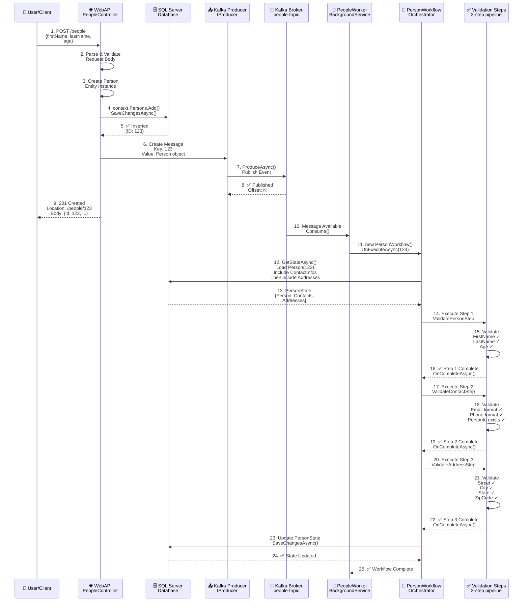

---

## 11. Kafka Message Flow

```mermaid
graph LR
    subgraph "Producer Side"
        PeopleCtrl["PeopleController<br/>Create/Update/Delete"]
        ContactCtrl["ContactController<br/>Create/Update/Delete"]
        AddressCtrl["AddressController<br/>Create/Update/Delete"]
        Event["Events Created<br/>Key: PersonId<br/>Value: Entity Object"]
        ProducerInstance["IProducer&lt;int, T&gt;<br/>Kafka Producer"]
    end

    subgraph "Kafka Broker"
        PeopleTopic["people-topic<br/>Partitions: 1<br/>Replication: 1"]
        ContactTopic["contact-topic<br/>Partitions: 1<br/>Replication: 1"]
        AddressTopic["address-topic<br/>Partitions: 1<br/>Replication: 1"]

        PeoplePartition["Partition 0<br/>Offset: 0..N"]
        ContactPartition["Partition 0<br/>Offset: 0..N"]
        AddressPartition["Partition 0<br/>Offset: 0..N"]
    end

    subgraph "Consumer Side"
        PeopleConsumer["IConsumer&lt;int, Person&gt;<br/>people-consumer-group"]
        ContactConsumer["IConsumer&lt;int, ContactInfo&gt;<br/>people-consumer-group"]
        AddressConsumer["IConsumer&lt;int, Address&gt;<br/>people-consumer-group"]
    end

    subgraph "Worker Processing"
        PeopleWorker["PeopleWorker<br/>BackgroundService"]
        ContactWorker["ContactWorker<br/>BackgroundService"]
        AddressWorker["AddressWorker<br/>BackgroundService"]
    end

    subgraph "Workflow Processing"
        PersonWorkflow["PersonWorkflow<br/>Orchestrator"]
        ValidationSteps["Validation Steps<br/>Person/Contact/Address"]
    end

    PeopleCtrl -->|Person Event| Event
    ContactCtrl -->|ContactInfo Event| Event
    AddressCtrl -->|Address Event| Event

    Event -->|Send| ProducerInstance

    ProducerInstance -->|Publish| PeopleTopic
    ProducerInstance -->|Publish| ContactTopic
    ProducerInstance -->|Publish| AddressTopic

    PeopleTopic -->|Store| PeoplePartition
    ContactTopic -->|Store| ContactPartition
    AddressTopic -->|Store| AddressPartition

    PeopleConsumer -.->|Subscribe| PeopleTopic
    ContactConsumer -.->|Subscribe| ContactTopic
    AddressConsumer -.->|Subscribe| AddressTopic

    PeoplePartition -->|Consume| PeopleWorker
    ContactPartition -->|Consume| ContactWorker
    AddressPartition -->|Consume| AddressWorker

    PeopleWorker -->|Execute| PersonWorkflow
    ContactWorker -->|Execute| PersonWorkflow
    AddressWorker -->|Execute| PersonWorkflow

    PersonWorkflow -->|Run Steps| ValidationSteps
    ValidationSteps -->|Update State| DB["🗄️ Database"]

    classDef producer fill:#3498db,stroke:#2c3e50,color:#fff
    classDef broker fill:#f39c12,stroke:#2c3e50,color:#fff
    classDef consumer fill:#e74c3c,stroke:#2c3e50,color:#fff
    classDef processing fill:#2ecc71,stroke:#2c3e50,color:#fff

    class PeopleCtrl,ContactCtrl,AddressCtrl,ProducerInstance,Event producer
    class PeopleTopic,ContactTopic,AddressTopic,PeoplePartition,ContactPartition,AddressPartition broker
    class PeopleConsumer,ContactConsumer,AddressConsumer,PeopleWorker,ContactWorker,AddressWorker consumer
    class PersonWorkflow,ValidationSteps,DB processing
```

---

## 12. Dependency Injection Container

```mermaid
graph TB
    subgraph "WebAPI - Program.cs"
        WebApiServices["Service Registration"]

        WebApiServices -->|AddDbContextPool| PeopleContext["PeopleContext&lt;PeopleContext&gt;<br/>EF Core DbContext"]
        WebApiServices -->|AddKafkaProducer| ProducerPerson["IProducer&lt;int, Person&gt;"]
        WebApiServices -->|AddKafkaProducer| ProducerContact["IProducer&lt;int, ContactInfo&gt;"]
        WebApiServices -->|AddKafkaProducer| ProducerAddress["IProducer&lt;int, Address&gt;"]
        WebApiServices -->|AddControllers| Controllers["PeopleController<br/>ContactController<br/>AddressController"]
        WebApiServices -->|AddOpenApi| OpenApi["OpenAPI + Scalar UI"]
        WebApiServices -->|AddServiceDefaults| Telemetry["Logging & Telemetry"]
    end

    subgraph "Consumer - Program.cs"
        ConsumerServices["Service Registration"]

        ConsumerServices -->|AddDbContextPool| PeopleContext2["PeopleContext&lt;PeopleContext&gt;<br/>EF Core DbContext"]
        ConsumerServices -->|AddKafkaConsumer| ConsumerPerson["IConsumer&lt;int, Person&gt;<br/>people-topic"]
        ConsumerServices -->|AddKafkaConsumer| ConsumerContact["IConsumer&lt;int, ContactInfo&gt;<br/>contact-topic"]
        ConsumerServices -->|AddKafkaConsumer| ConsumerAddress["IConsumer&lt;int, Address&gt;<br/>address-topic"]
        ConsumerServices -->|AddHostedService| PeopleWorker["PeopleWorker<br/>BackgroundService"]
        ConsumerServices -->|AddHostedService| ContactWorker["ContactWorker<br/>BackgroundService"]
        ConsumerServices -->|AddHostedService| AddressWorker["AddressWorker<br/>BackgroundService"]
        ConsumerServices -->|AddWorkflow| Workflow["PersonWorkflow&lt;int, PersonState&gt;"]
        ConsumerServices -->|RegisterStep| Step1["ValidatePersonStep"]
        ConsumerServices -->|RegisterStep| Step2["ValidateContactStep"]
        ConsumerServices -->|RegisterStep| Step3["ValidateAddressStep"]
        ConsumerServices -->|AddServiceDefaults| Telemetry2["Logging & Telemetry"]
    end

    subgraph "ServiceDefaults - Extensions.cs"
        Extensions["AddServiceDefaults&lt;TBuilder&gt;"]
        Extensions -->|ConfigureOpenTelemetry| Logging["Serilog + OpenTelemetry"]
        Extensions -->|AddDefaultHealthChecks| HealthDb["Database Health Check"]
        Extensions -->|AddDefaultHealthChecks| HealthKafka["Kafka Health Check"]
        Extensions -->|AddServiceDiscovery| Discovery["Service Discovery"]
        Extensions -->|AddResilienceHandler| Resilience["Resilience & Retry Logic"]
    end

    subgraph "Serialization"
        Serializations["KafkaJsonSerializer&lt;T&gt;"]
        Deserialization["KafkaJsonDeserializer&lt;T&gt;"]
        Serializations -->|Uses| JsonSettings["JsonSerializerSettings<br/>CamelCase Naming<br/>Ignore Null Values<br/>ISO DateTime"]
    end

    WebApiServices -->|Uses| Extensions
    ConsumerServices -->|Uses| Extensions

    ProducerPerson -.->|Uses| Serialization
    ProducerContact -.->|Uses| Serialization
    ProducerAddress -.->|Uses| Serialization

    ConsumerPerson -.->|Uses| Deserialization
    ConsumerContact -.->|Uses| Deserialization
    ConsumerAddress -.->|Uses| Deserialization

    classDef registration fill:#3498db,stroke:#2c3e50,color:#fff
    classDef service fill:#2ecc71,stroke:#2c3e50,color:#fff
    classDef extension fill:#9b59b6,stroke:#2c3e50,color:#fff
    classDef serialization fill:#f39c12,stroke:#2c3e50,color:#fff

    class WebApiServices,ConsumerServices registration
    class PeopleContext,ProducerPerson,ProducerContact,ProducerAddress,ConsumerPerson,ConsumerContact,ConsumerAddress,PeopleWorker,ContactWorker,AddressWorker,Workflow,Step1,Step2,Step3 service
    class Extensions,Logging,HealthDb,HealthKafka,Discovery,Resilience extension
    class Serialization,Deserialization,JsonSettings serialization
```

---

## 13. State Management in Workflow

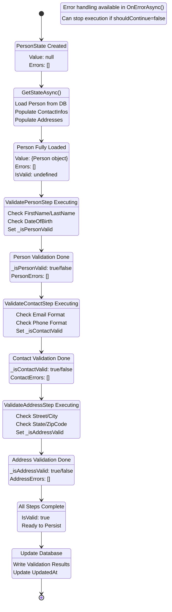

---

## 14. Project Dependencies Map

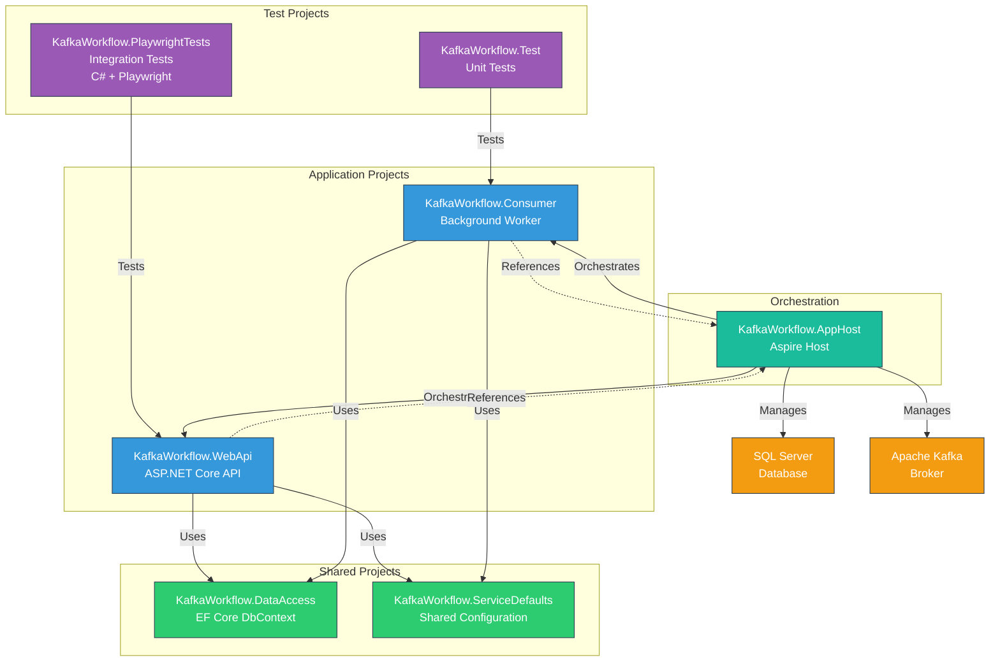

---

## 15. Error Handling Flow

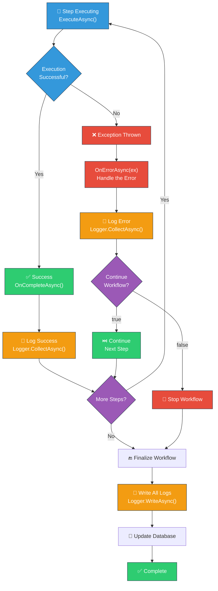

---

## Summary

These diagrams provide comprehensive visualization of the **KafkaWorkflow** distributed system architecture:

1. **System Architecture Overview** - Complete component layout with layers
2. **Data Flow Paths** - Synchronous and asynchronous request processing
3. **Service Dependencies** - How services reference and orchestrate each other
4. **Workflow Pipeline** - Step-by-step workflow execution and state management
5. **Database Schema** - Entity relationships (Person → ContactInfo → Address)
6. **Class Hierarchy** - OOP structure and inheritance of workflow framework
7. **REST API Endpoints** - All controller endpoints with HTTP methods and query parameters
8. **Testing Pyramid** - Test organization by layer (Unit → Integration → E2E)
9. **Aspire Dashboard** - Monitoring, resources, logs, and traces
10. **Complete Sequence Flow** - Full request lifecycle from POST to workflow completion
11. **Kafka Message Flow** - Three separate topics (people, contact, address) with workers
12. **Dependency Injection** - Service registration and configuration setup
13. **State Management** - Workflow state transitions and validation pipeline
14. **Project Dependencies** - Project references and relationships
15. **Error Handling** - Exception handling and recovery mechanisms

### Key Architecture Features

- **Three-Topic Kafka Architecture**: Separate topics for `people-topic`, `contact-topic`, and `address-topic`
- **Three-Worker Pattern**: `PeopleWorker`, `ContactWorker`, and `AddressWorker` process events independently
- **Unified Workflow**: All three workers execute the same `PersonWorkflow` orchestrator
- **Route-Based Parameters**: POST endpoints use route parameters (`/contact/{personId}`, `/address/{contactInfoId}`)
- **Generic Serialization**: Reusable `KafkaJsonSerializer<T>` and `KafkaJsonDeserializer<T>` for type safety
- **Three-Step Validation**: Sequential validation (Person → Contact → Address) in each workflow execution

All diagrams are created using **Mermaid** syntax and can be rendered in:
- GitHub markdown files
- GitLab markdown files
- Live Editor (https://mermaid.live)
- VS Code with Markdown Preview Support
- Any markdown renderer with support
