# KafkaWorkflow - Mermaid Architecture Diagrams

## 1. System Architecture Overview

```mermaid
graph TB
    subgraph "Presentation Layer"
        WebUI["🌐 Web Browser<br/>Scalar API Docs"]
        TestClient["🧪 Test Clients<br/>Playwright"]
    end

    subgraph "API Layer"
        PeopleCtrl["👤 PeopleController<br/>GET/POST/PUT/DELETE"]
        ContactCtrl["📧 ContactController<br/>GET/POST/PUT/DELETE"]
        AddressCtrl["🏠 AddressController<br/>GET/POST/PUT/DELETE"]
    end

    subgraph "Message Broker"
        Kafka["🔌 Apache Kafka<br/>people-topic"]
    end

    subgraph "Producer"
        Producer["📤 Kafka Producer<br/>Event Publishing"]
    end

    subgraph "Consumer & Workflow"
        ConsumerWorker["🔄 ConsumerWorker<br/>BackgroundService"]
        PersonWorkflow["🔁 PersonWorkflow<br/>Generic Workflow"]
        ValidateSteps["✅ Validation Steps<br/>Person/Contact/Address"]
    end

    subgraph "Data Access"
        DbContext["📦 PeopleContext<br/>Entity Framework"]
        Entities["🗂️ Entities<br/>Person/Contact/Address"]
    end

    subgraph "Infrastructure"
        SqlServer["🗄️ SQL Server<br/>People Database"]
        KafkaUI["📊 Kafka UI<br/>Broker Management"]
    end

    subgraph "Testing"
        UnitTests["🧪 Unit Tests<br/>NUnit + Moq"]
        IntegrationTests["🧪 Integration Tests<br/>Playwright C#"]
        E2ETests["🧪 E2E Tests<br/>Playwright TS"]
    end

    subgraph "Orchestration"
        Aspire["🎛️ Aspire Host<br/>Container Orchestration"]
    end

    WebUI -->|HTTP| PeopleCtrl
    TestClient -->|HTTP| PeopleCtrl
    
    PeopleCtrl --> DbContext
    ContactCtrl --> DbContext
    AddressCtrl --> DbContext
    
    PeopleCtrl --> Producer
    ContactCtrl --> Producer
    AddressCtrl --> Producer
    
    Producer --> Kafka
    Kafka --> ConsumerWorker
    
    ConsumerWorker --> PersonWorkflow
    PersonWorkflow --> ValidateSteps
    ValidateSteps --> DbContext
    
    DbContext --> Entities
    Entities --> SqlServer
    
    Kafka --> KafkaUI
    
    UnitTests -.-> PersonWorkflow
    IntegrationTests -.-> PeopleCtrl
    E2ETests -.-> PeopleCtrl
    
    Aspire -.-> PeopleCtrl
    Aspire -.-> ConsumerWorker
    Aspire -.-> SqlServer
    Aspire -.-> Kafka

    classDef api fill:#3498db,stroke:#2c3e50,color:#fff
    classDef workflow fill:#e74c3c,stroke:#2c3e50,color:#fff
    classDef data fill:#2ecc71,stroke:#2c3e50,color:#fff
    classDef infra fill:#f39c12,stroke:#2c3e50,color:#fff
    classDef test fill:#9b59b6,stroke:#2c3e50,color:#fff
    classDef orchestration fill:#1abc9c,stroke:#2c3e50,color:#fff
    
    class PeopleCtrl,ContactCtrl,AddressCtrl api
    class PersonWorkflow,ValidateSteps,ConsumerWorker workflow
    class DbContext,Entities,SqlServer data
    class Kafka,KafkaUI,Producer infra
    class UnitTests,IntegrationTests,E2ETests test
    class Aspire orchestration
```

---

## 2. Component Interaction & Data Flow

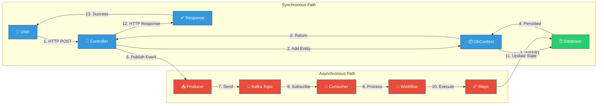

---

## 3. Service Dependencies & Wiring

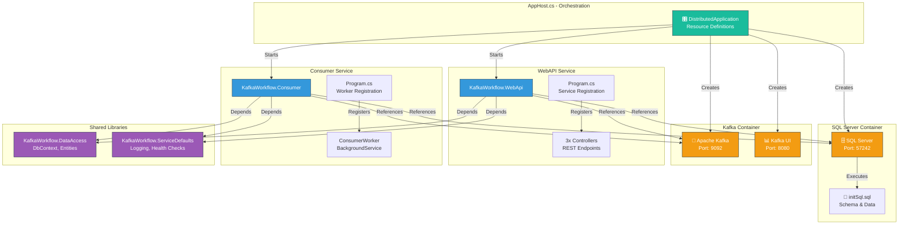

---

## 4. Workflow Execution Pipeline

```mermaid
graph TD
    Message["📬 Kafka Message<br/>Topic: people-topic"]
    
    Message --> ConsumerWorker["ConsumerWorker.ExecuteAsync()"]
    
    ConsumerWorker --> CreateWorkflow["Create Workflow Instance<br/>PersonWorkflow"]
    
    CreateWorkflow --> Execute["OnExecuteAsync<br/>Executes in Sequence"]
    
    Execute --> GetState["1️⃣ GetStateAsync()<br/>Load from Database"]
    
    GetState --> StateLoaded["PersonState Created<br/>Person, Contacts, Addresses"]
    
    StateLoaded --> ForEachStep["2️⃣ ForEach Step in Steps"]
    
    ForEachStep --> ShouldExecute["ShouldExecuteAsync()<br/>Check Conditions"]
    
    ShouldExecute --> |true| PreExecute["OnPreExecuteAsync()<br/>Setup & Initialization"]
    ShouldExecute --> |false| Skip["⏭️ Skip to Next Step"]
    
    PreExecute --> ExecuteStep["ExecuteAsync()<br/>Perform Business Logic"]
    
    ExecuteStep --> |Success| Complete["OnCompleteAsync()<br/>Cleanup & Finalize"]
    ExecuteStep --> |Exception| ErrorHandler["OnErrorAsync()<br/>Handle Error"]
    
    ErrorHandler --> |Continue=true| Skip
    ErrorHandler --> |Continue=false| Stop["⛔ Stop Workflow"]
    
    Complete --> NextStep{More Steps?}
    Skip --> NextStep
    
    NextStep --> |Yes| ForEachStep
    NextStep --> |No| WriteLog["Logger.WriteAsync()<br/>Persist Logs"]
    
    WriteLog --> UpdateDb["Update Database<br/>with Final State"]
    
    UpdateDb --> Complete2["✅ Workflow Complete"]
    
    Stop --> Error["❌ Workflow Failed"]
    
    classDef step1 fill:#3498db,stroke:#2c3e50,color:#fff
    classDef step2 fill:#e74c3c,stroke:#2c3e50,color:#fff
    classDef step3 fill:#2ecc71,stroke:#2c3e50,color:#fff
    classDef decision fill:#f39c12,stroke:#2c3e50,color:#fff
    classDef end fill:#27ae60,stroke:#2c3e50,color:#fff
    classDef error fill:#c0392b,stroke:#2c3e50,color:#fff
    
    class Message,ConsumerWorker,CreateWorkflow step1
    class Execute,ForEachStep step2
    class GetState,ShouldExecute,PreExecute,ExecuteStep,Complete step3
    class NextStep,ShouldExecute decision
    class Complete2 end
    class Error,Stop error
```

---

## 5. Database Entity Relationships

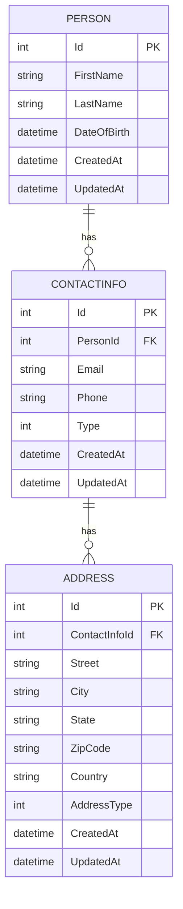

---

## 6. Class Hierarchy - Workflow Framework

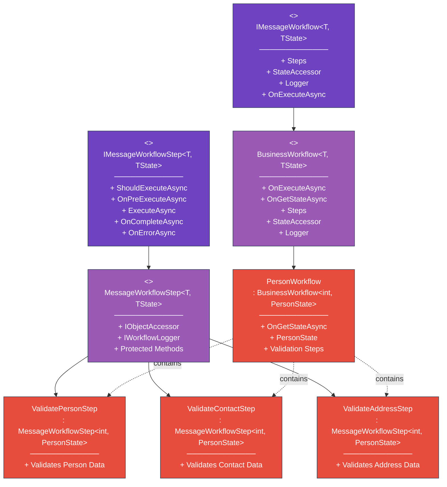

---

## 7. REST API Endpoints

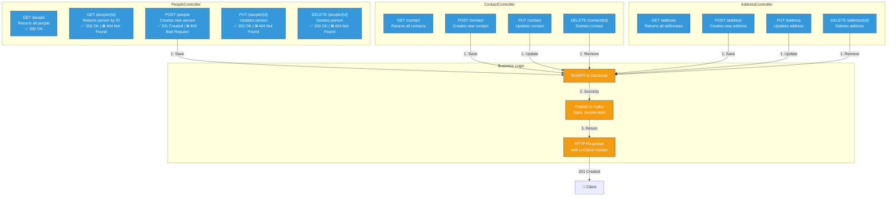

---

## 8. Testing Architecture Pyramid

```mermaid
graph TD
    Pyramid["Testing Pyramid"]
    
    subgraph "Unit Tests (Bottom - Fast)"
        UT1["PersonWorkflowTests<br/>✓ 4 test cases"]
        UT2["ValidatePersonStepTests<br/>✓ 3 test cases"]
        UT3["ValidateContactStepTests<br/>✓ 3 test cases"]
        UT4["ValidateAddressStepTests<br/>✓ 3 test cases"]
    end
    
    subgraph "Integration Tests (Middle - Medium)"
        IT1["PeopleControllerTests<br/>✓ 5 test cases"]
        IT2["ContactControllerTests<br/>✓ 5 test cases"]
        IT3["AddressControllerTests<br/>✓ 5 test cases"]
        IT4["MultiControllerWorkflowTests<br/>✓ 3 test cases"]
        IT5["PeopleControllerErrorHandlingTests<br/>✓ 4 test cases"]
    end
    
    subgraph "E2E Tests (Top - Slow)"
        E2E1["people.spec.ts<br/>✓ Playwright"]
        E2E2["contact.spec.ts<br/>✓ Playwright"]
        E2E3["address.spec.ts<br/>✓ Playwright"]
    end
    
    UT1 --> Framework1["Framework:<br/>NUnit + Moq"]
    UT2 --> Framework1
    UT3 --> Framework1
    UT4 --> Framework1
    
    IT1 --> Framework2["Framework:<br/>NUnit + Playwright<br/>+ Aspire"]
    IT2 --> Framework2
    IT3 --> Framework2
    IT4 --> Framework2
    IT5 --> Framework2
    
    E2E1 --> Framework3["Framework:<br/>Playwright<br/>TypeScript"]
    E2E2 --> Framework3
    E2E3 --> Framework3
    
    Framework1 -.->|13 Tests| Cost1["⚡ Cost: Low<br/>Time: &lt;1s"]
    Framework2 -.->|22 Tests| Cost2["⚡⚡⚡ Cost: Medium<br/>Time: 5-30s"]
    Framework3 -.->|~10 Tests| Cost3["⚡⚡⚡⚡⚡ Cost: High<br/>Time: 30-120s"]
    
    classDef unittests fill:#2ecc71,stroke:#2c3e50,color:#fff
    classDef integration fill:#f39c12,stroke:#2c3e50,color:#fff
    classDef e2e fill:#e74c3c,stroke:#2c3e50,color:#fff
    classDef framework fill:#3498db,stroke:#2c3e50,color:#fff
    classDef cost fill:#9b59b6,stroke:#2c3e50,color:#fff
    
    class UT1,UT2,UT3,UT4 unittests
    class IT1,IT2,IT3,IT4,IT5 integration
    class E2E1,E2E2,E2E3 e2e
    class Framework1,Framework2,Framework3 framework
    class Cost1,Cost2,Cost3 cost
```

---

## 9. Aspire Dashboard Resources

```mermaid
graph TB
    Dashboard["🎛️ Aspire Dashboard<br/>http://localhost:15251"]
    
    Dashboard --> Resources["📊 Resources Tab"]
    Dashboard --> Logs["📝 Logs Tab"]
    Dashboard --> Traces["🔍 Traces Tab"]
    
    Resources --> WebAPI["webapi<br/>ProjectResource<br/>State: Running<br/>Port: 5000/5001<br/>Depends: db, kafka"]
    Resources --> Consumer["kafka-consumer<br/>ProjectResource<br/>State: Running<br/>Depends: db, kafka"]
    Resources --> SqlServer["database<br/>ContainerResource<br/>State: Healthy<br/>Port: 57242<br/>Volume: sqlserver-data"]
    Resources --> Kafka["kafka<br/>ContainerResource<br/>State: Healthy<br/>Port: 9092<br/>Volume: kafka-data"]
    Resources --> KafkaUI["kafka-ui<br/>ContainerResource<br/>UI: http://localhost:8080"]
    
    Logs --> WebAPILogs["WebAPI Logs"]
    Logs --> ConsumerLogs["Consumer Logs"]
    Logs --> DbLogs["Database Logs"]
    Logs --> KafkaLogs["Kafka Logs"]
    
    Traces --> WebAPITraces["HTTP Request Traces"]
    Traces --> ConsumerTraces["Workflow Execution Traces"]
    Traces --> DbTraces["Database Query Traces"]
    
    classDef dashboard fill:#1abc9c,stroke:#2c3e50,color:#fff
    classDef running fill:#2ecc71,stroke:#2c3e50,color:#fff
    classDef healthy fill:#27ae60,stroke:#2c3e50,color:#fff
    classDef logs fill:#3498db,stroke:#2c3e50,color:#fff
    classDef traces fill:#9b59b6,stroke:#2c3e50,color:#fff
    
    class Dashboard dashboard
    class WebAPI,Consumer running
    class SqlServer,Kafka,KafkaUI healthy
    class WebAPILogs,ConsumerLogs,DbLogs,KafkaLogs logs
    class WebAPITraces,ConsumerTraces,DbTraces traces
```

---

## 10. Complete System Flow - Create Person Sequence

```mermaid
sequenceDiagram
    participant User as 👤 User/Client
    participant API as 🌐 WebAPI
    participant DB as 🗄️ Database
    participant KafkaP as 📤 Kafka Producer
    participant Topic as 🔌 Kafka Topic
    participant Consumer as 🔄 Consumer
    participant Workflow as 🔁 Workflow
    participant Steps as ✅ Validation Steps

    User->>API: POST /people<br/>{firstName, lastName}
    
    API->>API: 1. Parse Request
    API->>API: 2. Create Person Entity
    
    API->>DB: 3. Add & SaveChanges
    DB-->>API: 4. Person Saved<br/>(ID: 123)
    
    API->>KafkaP: 5. ProduceAsync(event)
    KafkaP->>Topic: 6. Publish Event<br/>{Key: "123",<br/>Value: "Create"}
    
    API-->>User: 7. 201 Created<br/>{id: 123, ...}
    
    Topic->>Consumer: 8. Message Available
    Consumer->>Workflow: 9. Create & Execute<br/>Workflow(123)
    
    Workflow->>DB: 10. Load Person(123)
    DB-->>Workflow: 11. Person + Relations
    
    Workflow->>Steps: 12. Execute<br/>ValidatePersonStep
    Steps->>Steps: 13. Validate Data
    Steps-->>Workflow: 14. ✅ Valid
    
    Workflow->>Steps: 15. Execute<br/>ValidateContactStep
    Steps->>Steps: 16. Validate Data
    Steps-->>Workflow: 17. ✅ Valid
    
    Workflow->>Steps: 18. Execute<br/>ValidateAddressStep
    Steps->>Steps: 19. Validate Data
    Steps-->>Workflow: 20. ✅ Valid
    
    Workflow->>DB: 21. Update State
    DB-->>Workflow: 22. Updated
    
    Workflow-->>Consumer: 23. Complete ✅

    classDef sync fill:#3498db,stroke:#2c3e50,color:#fff
    classDef async fill:#e74c3c,stroke:#2c3e50,color:#fff
    classDef storage fill:#2ecc71,stroke:#2c3e50,color:#fff
    
    class User,API,KafkaP sync
    class Consumer,Workflow,Steps async
    class DB,Topic storage
```

---

## 11. Kafka Message Flow

```mermaid
graph LR
    subgraph "Producer Side"
        Controller["PeopleController"]
        Event["Event Created<br/>Key: PersonId<br/>Value: OperationType"]
        ProducerInstance["IProducer&lt;string, string&gt;"]
    end
    
    subgraph "Kafka Broker"
        Topic["people-topic<br/>Partitions: 1<br/>Replication: 1"]
        PartitionZero["Partition 0<br/>Offset: 0..N"]
    end
    
    subgraph "Consumer Side"
        ConsumerInstance["IConsumer&lt;string, string&gt;"]
        ConsumerGroup["Consumer Group:<br/>people-consumer-group"]
        Worker["ConsumerWorker<br/>BackgroundService"]
    end
    
    subgraph "Processing"
        Deserialization["Deserialize Message"]
        PersonWorkflow["PersonWorkflow<br/>Processing"]
        Validation["Validation Steps"]
    end
    
    Controller -->|Create Message| Event
    Event -->|Send| ProducerInstance
    ProducerInstance -->|Publish| Topic
    
    Topic -->|Store| PartitionZero
    
    ConsumerInstance -.->|Subscribe| Topic
    ConsumerInstance -->|Assign| ConsumerGroup
    ConsumerGroup -->|Read| PartitionZero
    
    PartitionZero -->|Consume| Worker
    Worker -->|Deserialize| Deserialization
    Deserialization -->|Process| PersonWorkflow
    PersonWorkflow -->|Execute| Validation
    
    classDef producer fill:#3498db,stroke:#2c3e50,color:#fff
    classDef broker fill:#f39c12,stroke:#2c3e50,color:#fff
    classDef consumer fill:#e74c3c,stroke:#2c3e50,color:#fff
    classDef processing fill:#2ecc71,stroke:#2c3e50,color:#fff
    
    class Controller,ProducerInstance,Event producer
    class Topic,PartitionZero broker
    class ConsumerInstance,ConsumerGroup,Worker consumer
    class Deserialization,PersonWorkflow,Validation processing
```

---

## 12. Dependency Injection Container

```mermaid
graph TB
    subgraph "WebAPI - Program.cs"
        WebApiServices["Service Registration"]
        
        WebApiServices -->|AddScoped| PeopleContext["PeopleContext<br/>DbContext"]
        WebApiServices -->|AddScoped| Producer["IProducer&lt;string, string&gt;<br/>Kafka Producer"]
        WebApiServices -->|AddControllers| Controllers["API Controllers"]
        WebApiServices -->|AddHealthChecks| HealthChecks["Health Check Endpoints"]
        WebApiServices -->|Configure| Logging["Logging & Telemetry"]
    end
    
    subgraph "Consumer - Program.cs"
        ConsumerServices["Service Registration"]
        
        ConsumerServices -->|AddScoped| PeopleContext2["PeopleContext<br/>DbContext"]
        ConsumerServices -->|AddScoped| Consumer["IConsumer&lt;string, string&gt;<br/>Kafka Consumer"]
        ConsumerServices -->|AddScoped| PersonWorkflow["PersonWorkflow<br/>Workflow"]
        ConsumerServices -->|AddScoped| Steps["Validation Steps<br/>DI for Steps"]
        ConsumerServices -->|AddHostedService| ConsumerWorker["ConsumerWorker<br/>BackgroundService"]
        ConsumerServices -->|Configure| Logging2["Logging & Telemetry"]
    end
    
    subgraph "ServiceDefaults - Extensions.cs"
        Extensions["Extension Methods"]
        Extensions -->|ConfigureLogging| Serilog["Serilog Setup"]
        Extensions -->|AddHealthChecks| DbHealth["Database Health Check"]
        Extensions -->|AddHealthChecks| KafkaHealth["Kafka Health Check"]
        Extensions -->|AddTelemetry| OpenTelemetry["OpenTelemetry"]
    end
    
    WebApiServices -->|Uses| Extensions
    ConsumerServices -->|Uses| Extensions
    
    classDef registration fill:#3498db,stroke:#2c3e50,color:#fff
    classDef service fill:#2ecc71,stroke:#2c3e50,color:#fff
    classDef extension fill:#9b59b6,stroke:#2c3e50,color:#fff
    
    class WebApiServices,ConsumerServices registration
    class PeopleContext,Producer,Consumer,PersonWorkflow,Steps,ConsumerWorker service
    class Extensions,Serilog,DbHealth,KafkaHealth,OpenTelemetry extension
```

---

## 13. State Management in Workflow

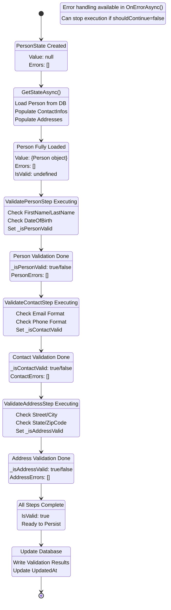

---

## 14. Project Dependencies Map

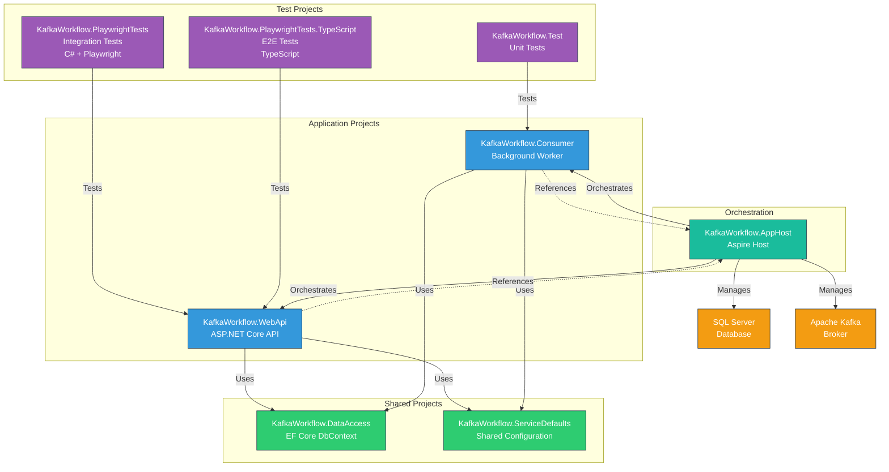

---

## 15. Error Handling Flow

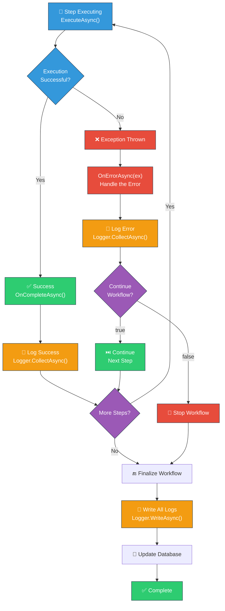

---

## Summary

These diagrams provide comprehensive visualization of the KafkaWorkflow architecture:

1. **System Overview** - High-level component layout
2. **Data Flow** - Sync and async request paths
3. **Service Dependencies** - How services reference each other
4. **Workflow Pipeline** - Step-by-step workflow execution
5. **Database** - Entity relationships and schema
6. **Class Hierarchy** - OOP structure of workflow framework
7. **API Endpoints** - REST endpoints and operations
8. **Testing** - Test pyramid and organization
9. **Aspire Dashboard** - Monitoring and resource management
10. **Sequence Diagram** - Complete create person flow
11. **Kafka Flow** - Message production and consumption
12. **DI Container** - Service registration and configuration
13. **State Management** - Workflow state transitions
14. **Project Dependencies** - Project references and relationships
15. **Error Handling** - Exception handling and recovery flow

All diagrams are created using Mermaid and can be rendered in markdown viewers, GitHub, GitLab, and many other platforms.
